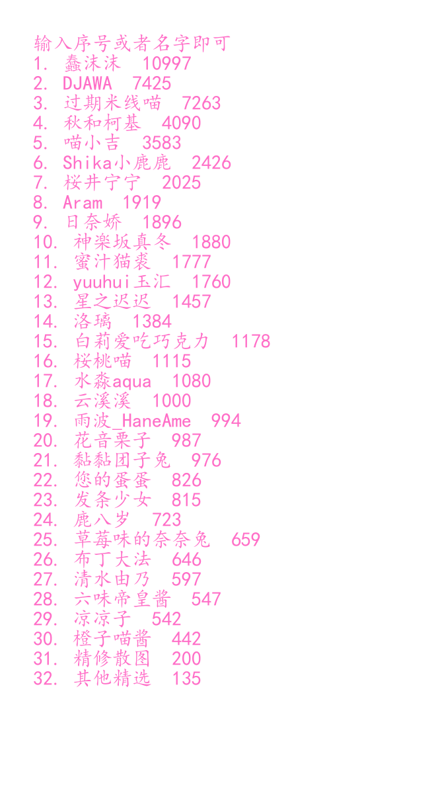
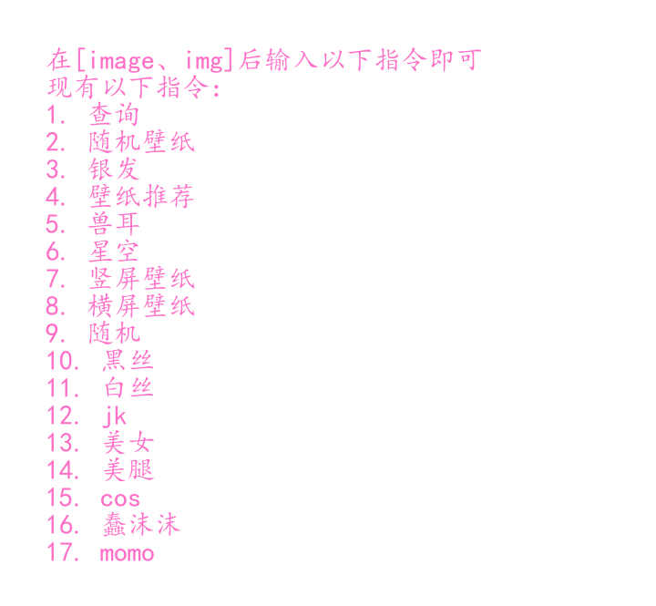

# QQ-Bot
基于go-cqhttp和nonebot2运行的机器人插件

内有众多自用插件

# 下面是插件的一些介绍

## 小思聊天
对话来自：[对话机器人-思知](https://www.ownthink.com/robot.html)  
发送‘闲聊’或者‘呼叫小思’即可开始闲聊  
发送\end即可退出闲聊

## dongti

*<font size=3>附有图片数据库 </font>*  
 
随机发送图片  
命令为：`dt`  
dt可以跟相关指令或者序号指定发送图片  
例如：
```
dt 1 
dt蠢沫沫
```

## 翻译（有道）
基于有道网页版翻译
直接在‘翻译’的后面加上需要翻译的文字即可  
例如：  
```
翻译 我爱你
翻译我爱你
翻译 我爱你，中译英（这里必须是中文逗号）

--->i live you
```
## 猜数字小游戏
发送`猜数字`即可开始猜数字小游戏  
可以选择是否直接发送数字  
如果选择否，数字每次都会随机变更  
让玩家猜不到数字  
如果使用二分法猜数字  
第十次是必定猜中的

## 发送图片
命令是：`img` 或者 `image`  
直接发送命令随机发放图片  
命令后面跟特殊指令指定发放图片  



## 音乐获取
命令是：`music` 、`音乐` 或 `歌曲`  
命令后可直接跟歌曲名和歌手名  
音乐来源：[DiFiNi-音乐磁场](https://www.hifini.com/)

## setu
命令：`setu`、`色图`或`涩图`  
随机发送setu，命令后可跟特殊指令  
例如：  
```
setu 萝莉
setu 萝莉，黑丝
---> 检索词越多，结果越少
```
以上指令默认非r18，如果需要检索r18，则需要在最后一个检索词后面加上 `y`  
例如：  
```
setu萝莉，y
setu y
```
*~~注：r18图片发送30S后会自动撤回~~*

## 定时更新群备注
每5s会检查备注是否符合标准 如若不符合则会更改为  
`qqBot+时间`  
例如：  
`qqBot~ 2023-07-05 14:36`  
可以自定义修改

## 刷微信步数
命令：`刷步`  
命令后面跟具体步数  
如果只发送‘刷步’则会从10000 - 25666之间随机一个数字  
可设置每天自动刷步数  
默认为每天晚上八点半刷步

需要提前准备ZeepLife（原小米运动）账号 并绑定微信  
发送指令 `刷步绑定` 输入账号密码之后绑定为你当前的qq号  
定时刷步开关指令：`定时刷 开` 或 `定时刷 关`  
***<font size=4>注：需要在文件中把qq号改为自己的</font>***
